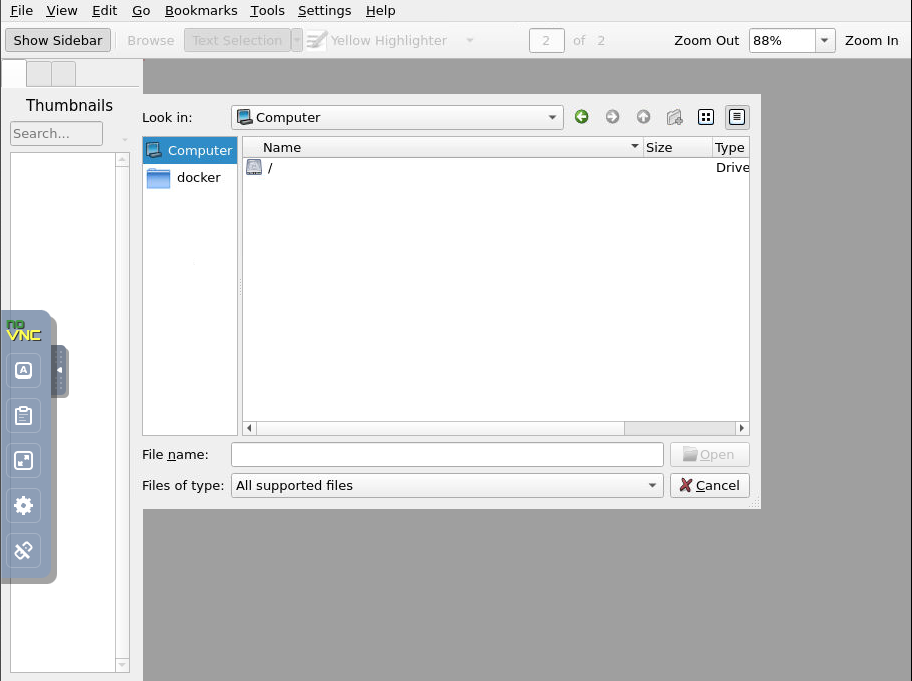

# Run application with docker
Using the docker image to run Pdf Editor (https://okular.kde.org/) on my Synology NAS


## Usage
### Build image
- Build image
```bash
docker build -t pdf-editor .
```
- Tag it
```bash
docker tag pdf-editor:latest <YOUR-DOCKERHUB>/pdf-editor
```
- Push to docker registry
```bash
docker push <YOUR-DOCKERHUB>/pdf-editor:latest
```
- Your image should be visible here: `https://<YOUR-DOCKERHUB>/v2/_catalog`

### Server
- Run
```bash
docker run -v <YOUR-PDF-FOLDERS>:/home/docker/data -p 8080:8080 pdf-editor:latest
```

### Client
Visit `http://hostname:8080` by the browser you like

## Credit
Based on <https://github.com/sykuang/docker-wine-x11-novnc>
